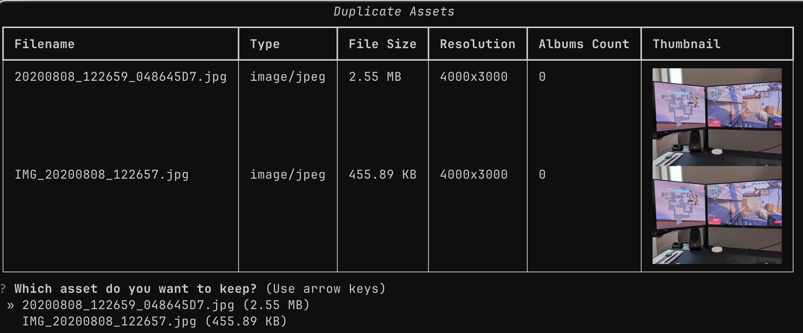

# immich-python-scripts

A few python scripts to manage my Immich library

## Run

```sh
uv run immich_scripts
```

You need a kitty-compatible terminal to view the thumbnails. I use Ghostty.

## Demo



## TODO

- [x] Drop textualize for a simpler approach
- [x] Logging
- [x] Image display
- [ ] Automated full image deduplication with a few rules
- [ ] Video deduplication
